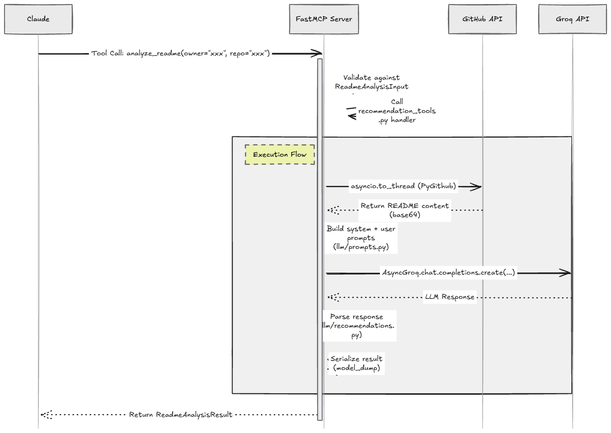

# Architecture — GitHub Repository Manager MCP

This document explains the structural choices behind the project and how the components interact at runtime. It is intended for contributors and reviewers who want to understand *why* things are built the way they are, not just *what* they are.

---

## 1. Transport choice: HTTP/SSE over stdio

MCP supports two transport modes: `stdio` (subprocess, used by Claude Desktop locally) and HTTP/SSE (used by Claude.ai and any remote client).

This project uses **HTTP/SSE exclusively** for the following reasons:

- Claude.ai's remote MCP integration requires a public HTTPS endpoint — stdio is not applicable.
- HTTP/SSE allows multiple clients to connect to the same server instance without spawning subprocesses.
- It enables deployment as a Docker container with a single exposed port, which fits standard cloud setups.
- Operational visibility: HTTP logs are structured and interceptable; stdio pipes are opaque.

The tradeoff is that local setup requires running a server process instead of registering an executable — this is documented in the Quick Start.

---

## 2. Tool organization: one module per GitHub domain

Tools are split into five modules (`repository_tools`, `branch_tools`, `issue_tools`, `pr_tools`, `recommendation_tools`) rather than grouped by operation type (read vs. write).

Rationale:
- Each module maps directly to a GitHub API resource family, mirroring the mental model of any developer who has read GitHub's docs.
- It keeps each file focused — a developer working on PR logic never opens `issue_tools.py`.
- New tool categories (e.g., Actions, Releases) can be added as new modules without modifying existing ones.

Each tool module registers its tools against the shared `mcp` FastMCP instance imported from `main.py`. There is no tool registry object — FastMCP's decorator pattern handles registration.

---

## 3. GitHub client layer: thin wrapper over PyGithub

`github/client.py` holds a single authenticated `Github` instance initialized from `config.py`. All domain modules (`repositories.py`, `branches.py`, etc.) import the client and call PyGithub methods.

Design choice: the domain modules contain **business logic** (e.g., computing staleness, building directory trees), while `client.py` contains **only connection setup**. This separation means:
- Tests can mock `client.py` without reimplementing GitHub's API.
- If PyGithub is ever replaced (e.g., with `httpx` + raw REST calls), only `client.py` changes.

Async note: PyGithub is synchronous. All GitHub calls are wrapped with `asyncio.to_thread()` at the tool layer to avoid blocking the event loop. This is explicit and visible — no hidden thread pools.

---


---

## 4. Prompt management: `prompts.py` as the single source of truth

All system prompts and user prompt templates live in `llm/prompts.py` as module-level constants (typed `str`). No prompt is inlined in business logic or tool handlers.

Benefits:
- Prompts can be reviewed, versioned, and improved independently of Python logic.
- `recommendations.py` composes prompts from parts (system prompt + data context + instruction) using simple string formatting — no templating engine needed at this scale.
- Keeping prompts in one file makes it easy to audit what the LLM is being asked to do.

---

## 5. Schema layer: Pydantic v2 throughout

`models/schemas.py` defines Pydantic models for all tool inputs and all structured outputs (repo info, issue summaries, recommendations, etc.).

This is enforced at two levels:
- **Tool inputs**: FastMCP validates tool arguments against Pydantic models before calling the handler.
- **Tool outputs**: Handlers serialize their return value using `.model_dump()` before returning to MCP. The AI assistant receives a predictable structure.

Raw PyGithub objects are never returned directly — they are always mapped to a schema model first. This keeps the contract between the server and the AI client stable even if the underlying library changes.

---

## 6. Configuration: Pydantic Settings + `.env`

`config.py` uses a `pydantic_settings.BaseSettings` class. All environment variables are typed, have defaults where sensible, and are validated at startup.

Startup fails fast if required variables (`GITHUB_TOKEN`, `GROQ_API_KEY`) are missing — this is preferable to a runtime error inside a tool call.

No `os.environ.get()` calls appear outside `config.py`. Other modules import the settings singleton: `from config import settings`.

---

## 7. Technology stack in practice

The repository uses a focused set of Python dependencies rather than a broad framework stack. The main technologies in the implementation are:

| Area | Technology | Role |
|------|------------|------|
| Runtime | Python 3.11+ | Async execution, typing, and the base application runtime |
| MCP server | FastMCP | Registers tools and serves the HTTP/SSE endpoint |
| GitHub integration | PyGithub | Wraps GitHub REST API access for repositories, branches, issues, and PRs |
| LLM integration | Groq Python SDK | Powers the recommendation and README analysis features |
| Validation | Pydantic v2 | Validates inputs and shapes structured outputs |
| Settings | pydantic-settings | Loads and validates environment configuration |
| Environment loading | python-dotenv | Supports local `.env` workflows |
| Structured logs | structlog | Provides traceable application logs |
| Response repair | json-repair | Helps recover structured data from imperfect model output |
| Test runner | pytest | Runs the unit and integration test suite |

---

## 8. Error handling: custom exceptions + MCP error mapping

`utils/exceptions.py` defines:
- `GitHubClientError` — wraps PyGithub exceptions with context
- `LLMError` — wraps Groq API errors
- `ToolInputError` — invalid arguments that pass Pydantic but fail business logic

Tool handlers catch these and re-raise as FastMCP `McpError` with appropriate error codes. This means the AI assistant receives a structured error it can interpret (e.g., "repository not found") rather than a Python traceback.

---

## Data Flow: `analyze_readme` example



---

## Testing strategy

```
tests/
├── unit/
│   ├── test_schemas.py          # Pydantic model validation edge cases
│   ├── test_prompts.py          # Prompt formatting correctness
│   ├── test_branch_staleness.py # Business logic: date arithmetic
│   └── test_exceptions.py       # Error mapping
│
└── integration/
    ├── test_github_client.py     # Real GitHub API calls (needs token)
    └── test_tools_e2e.py         # Full tool call → response cycle
```

Unit tests use `pytest` with `unittest.mock` for GitHub and Groq calls. Integration tests require a valid `GITHUB_TOKEN` and target a dedicated test repository to avoid polluting real repos.

---


